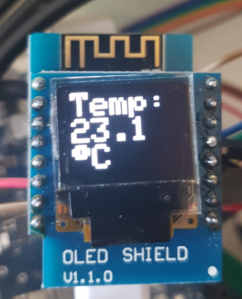

# IThermometer
WIFI Thermometer für Brauerei

## Danksagung:
Ein großes Dankeschön soll an dieser Stelle an universam gehen, der mit seine ISpindel
praktisch eine fast fertige Vorlage für meinen Thermometer geliefert hat.  
https://github.com/universam1/iSpindel  
Ebenfalls Danke möchte ich glassart sagen, der mich immer kräftig beim Testen unterstützt.

## Bauteileliste:

- WEMOS D1 Mini
- DS18B20 Temperatursensor
- Widerstand 4,7 KOhm
- ggf. USB-Kabel und USB-Steckernetzteil ( hat wohl jeder heute was rum zu liegen )

Sieht kompliziert aus, ist es aber gar nicht ....

IThermometer gem. Schaltplan.jpg verdrahten

## Installation:

- IThermometer am USB-Port anschließen
- ESP8266Flasher.exe öffnen
- Auf Config Reiter wechseln
- IThermometer.bin öffnen ( Erstes Zahnrädchen )
- Auf Operation Reiter wechseln
- COM-Port des WEMOS auswählen
- Flashen

### Der IThermometer ist fertig !

## Bedienung:

- Zwei mal Reset am WEMOS drücken, dazwischen ein zwei Sekunden Pause lassen.
- WEMOS spannt ein eigenes WLAN-Netzwerk auf, die LED am WEMOS leuchtet durchgehend.
- Mit geeignetem Gerät mit dem WLAN des WEMOS verbinden ( z.B. Handy, Tablet, Laptop.... )
- Browser an dem verbunden Gerät öffnen.
- Wenn die Config-Seite nicht automatisch öffnet im Browser die Adresse 192.168.4.1 eingeben
- Auf Config clicken und die WLAN-Daten eingeben - anschliessend "SAVE" drücken
- Der WEMOS prüft jetzt, ob die Eingaben stimmen, verbindet sich mit dem angegebenen WLAN-Netzwerk.

## Verhalten:

Der WEMOS sendet jetzt im 5 Sekundentakt UDP-Nachrichten auf dem eingegeben Port durchs Netzwerk. 

## Bedienung in der Brauerei:

- In der Brauerei Temperaturmessung "Arduino" wählen.
- Auf dem Arduino Reiter "LAN/WLAN" wählen und den passenden "Port-IN" wählen
- "Port-Out", "IP-Out" und "Sensortyp" spielen für das iThermometer keine Rolle. 

## Abschluss:

Fertig, die Brauerei sollte jetzt die Temperatur anzeigen.
Diese Prozedur ist nur einmal nötig. Die Einstellungen bleiben in der Brauerei und im WEMOS erhalten.
Will man die Einstellungen ändern, 2x mit kurzem Abstand Reset am WEMOS drücken.
Die USB-Verbindung ist ebenfalls nicht mehr nötig. Der WEMOS kann mit einem beliebigen Handy-USB-Ladegerät 
mit Spannung versorgt werden.
Die Datenübertragung erfolgt kabellos per WLAN.

## Zusatzoptionen:
- Ich hab für den WEMOS ein recht passendes Gehäuse bei Ebay gefunden. Da passt der WEMOS inkl. des USB-Steckers rein. Auf der anderen seite kommt dann der DS18B20 rein. Noch zweil löcher rein gebohrt, damit man an den Reset-Button des WEMOS kommt und eins damit man das blinkende LED sieht, WEMOS mit doppelseitigem Klebeband rein geklebt... fertig.  
  [>Link<](http://www.ebay.de/itm/401126237744?_trksid=p2060353.m2749.l2649&ssPageName=STRK%3AMEBIDX%3AIT "Link zum Gehäuseanbieter bei Ebay")  
- Wer etwas mehr löten mag kann auf den WEMOS noch ein OLED aufstecken und bekommt damit die Temperatur auch direkt angezeigt. Aber vorsicht, damit passt das Gehäuse natürlich nicht mehr.  
  [>Link<](http://www.ebay.de/itm/WeMos-D1-mini-WiFi-OLED-0-66-I2C-TFT-Modul-ESP8266-NodeMcu-LUA-/291999752242?hash=item43fc8aa032:g:cRAAAOSwjDZYeWj1 "Link zum OLED-Anbieter bei Ebay")  
  
  
